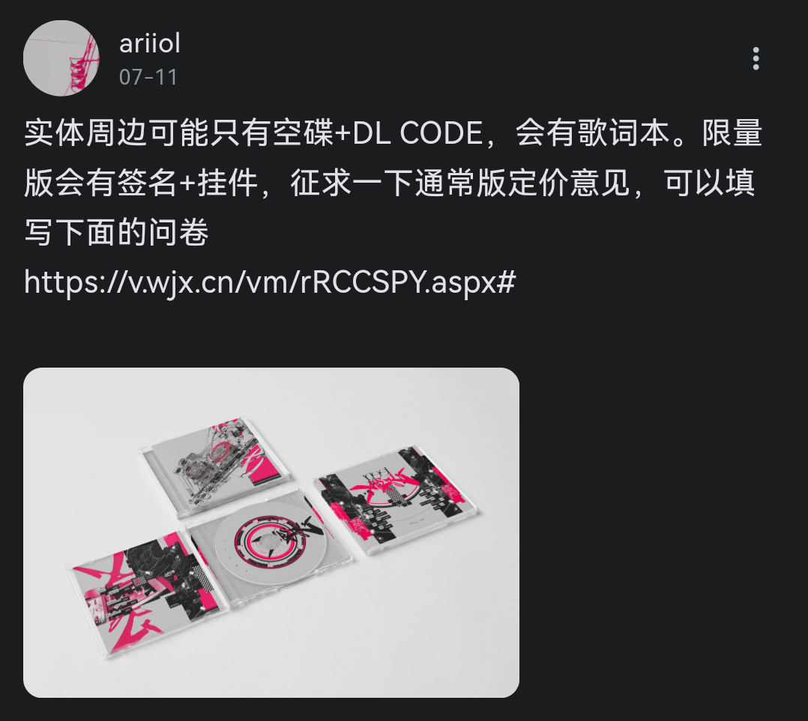
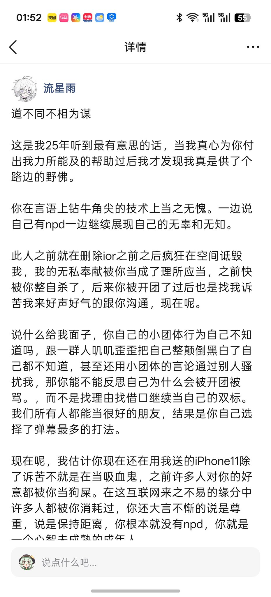
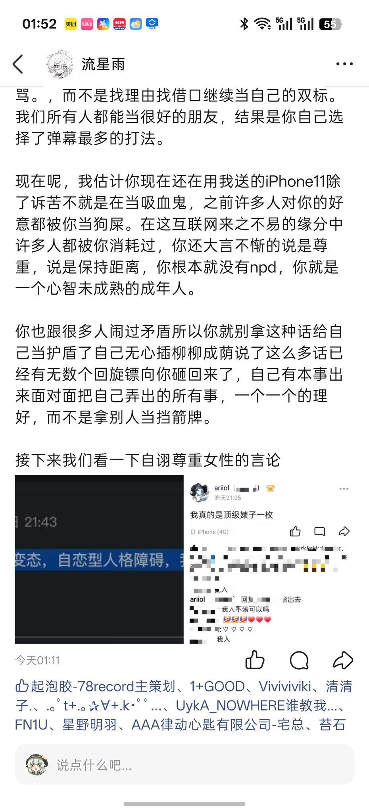
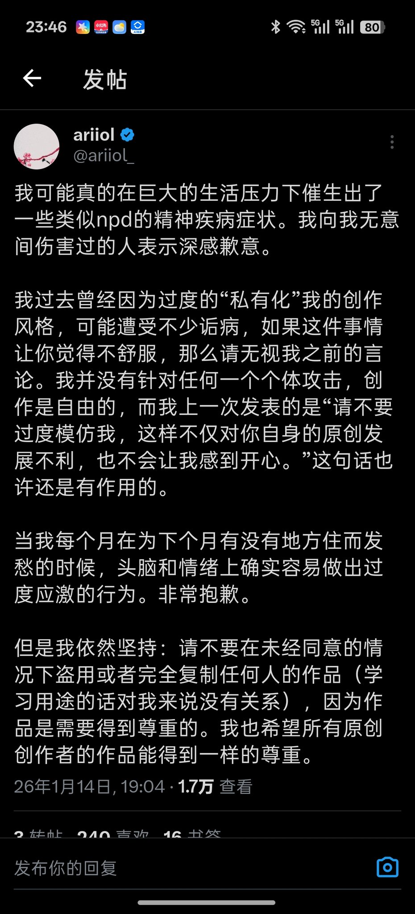
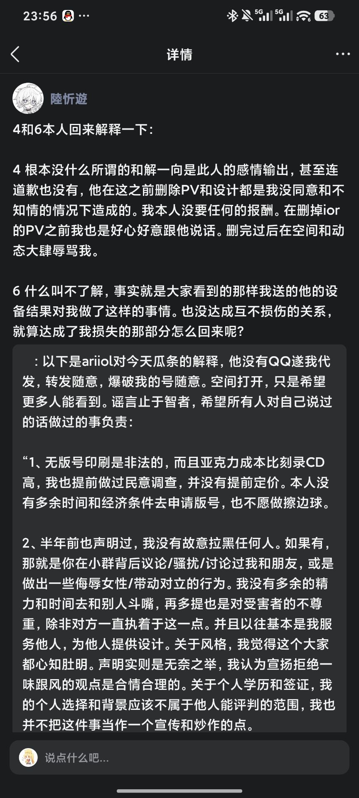

**[Ariiol](https://space.bilibili.com/432511655)'s Misconduct Record (Excerpted from Group Chat Records)**

## 1. Greed

Ariiol attempted to profit off his fanbase by selling blank unrecorded music discs to squeeze money from supporters, yet he has never treated his fans as genuine audiences or respected their support.
> \
> Ariiol's post about CD

Hе explicitly asked the PV creator Lu for an iPhone 11 as a gift. After falling out with Lu, he **never once** offered to return the device, eventhough he earns roughly 1800 RMB per commission on the art platform Mix画师. He only claimed to "have the intention of repaying" Lu after public backlash and negative public opinion began to spread against him.
> \
> \
> Lu's Evidence

## 2. Arrogance

After rising to fame in the electronicmusic scene, Ariiol **unfriended** and **cut off** contact with almost all non-top-tier producers in the community. He publicly stated that other creators should not imitate his works, arrogantly comparing himself to wowaka. In reality, his so-called original style is nothing more than stacking hi-hats on basic kick patterns, yet he hype this mediocre technique as aninnovative musical breakthrough.

On his birthday, he **unfollowed** and **blocked** small, low-traffic creators who sent him sincere birthday wishes.

He also abandoned his academic future to chase quick wealth in Shanghai ahead of his unified college entrance examinations. He ultimately failed to get rich and completely ruined his chance of obtaining a bachelor's degree.

After collaborating with Volta and other producers on a Hyperflip track (from which he allegedly profited), he posted on his [X(formerly Twitter) alt account @ariiol_sub](https://x.com/ariiol_sub) that the Spring M3 event would be his "last dance" in electronic music,announcing his plan to switch entirely to pop music. After being called out by the community for this statement, he issued an insincere, half-hearted apology in group chats, claiming he "never intended to quit electronic music".
> \
> the post about his quit on his alt account

He also fabricated claims that hesuffers from [NPD (Narcissistic Personality Disorder)](https://en.wikipedia.org/wiki/Narcissistic_personality_disorder) as an excusefor his problematic behavior. It is worth mentioning that NPD has 50% treatment success rate with professional intervention; mental illnesses left untreated only hurt oneself and everyone around them,and he ought to seek medical treatment immediately if he truly has psychological issues.
> \
> the post about his NPD on his main account

## 3. Envy

He refuses to tolerate any negative comments or objective criticism about his works. He insists on being unconventional and claims his "pure ears" cannot bear any negative feedback, refusing aldissenting voices.

## 4. Wrath

Ariiol unilaterally deleted his BOF competition entry IOR after apersonal conflict with PV creator Lu, throwing a fit and portraying himself as an innocent victim to the public. In stark contrast, Lu completed all PV production work for the project completely free of charge and never asked for any рaуment.
> \
> Lu's response about Ariiol deleted his BOF competition PV

## 5. Sloth

He often makes up sob stories about being unable to pay rent to beg for donations from fans, while raising his commission prices at the same time. Instead of using the money for living expenses, he spends fan donations indulging in the arcade rhythm game [MaiMaiDX](https://maimai.sega.com/).
> \
> spends fan donations evidence

He also commits unprofessional plagiarism by reselling old tracks he released publicly online as exclusive custom commercial works for his client, Paradigm Origin.

## 6. Gluttony (Insatiable Greed)

Driven by endless selfish desire,Ariiol deleted Lu from his contact list without hesitation--this is the same Lu who gifted him a free iPhone 11, a high-value device he still refuses to return voluntarily.

## 7. Lust & False Persona

On his [X(formerly Twitter) main account @ariiol_](https://x.com/ariiol_), Ariiol built a fake persona of "studying Japanese diligently" despite not even being able to recognize basic Japanese kana. When facing career and public pressure, he vented emotionally to Japanese netizens,craved their sympathy, and expressed an excessive desire to move to Japan.

## Additional Commentary & Final Thoughts (By 叶留宸/Sseeasm)

The community once believed that IOR would mark the start of Ariiol's peak musical career, yet it turned out to be nothing more than a fleeting flash of talent. All of his subsequent tracks, which he markets as his "unique personastyle", are merely clumsy, repetitive imitations of his old works, relying entirely on mindless stacking of pitched vocal chops with no real musical innovation or progression.